```{r echo=FALSE}
knitr::opts_chunk$set(
  echo = FALSE,
  warning = FALSE,
  message = FALSE,
  dpi = 320,
  cache = FALSE,
  fig.align = 'center'
)
```

#

```{r}

```

#

```{r}
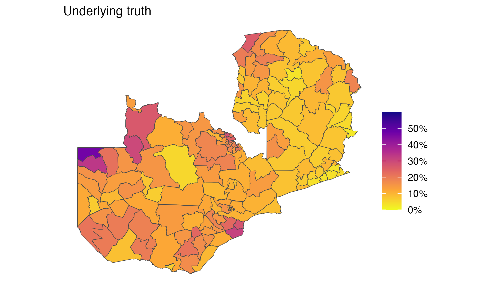
```

#

```{r}
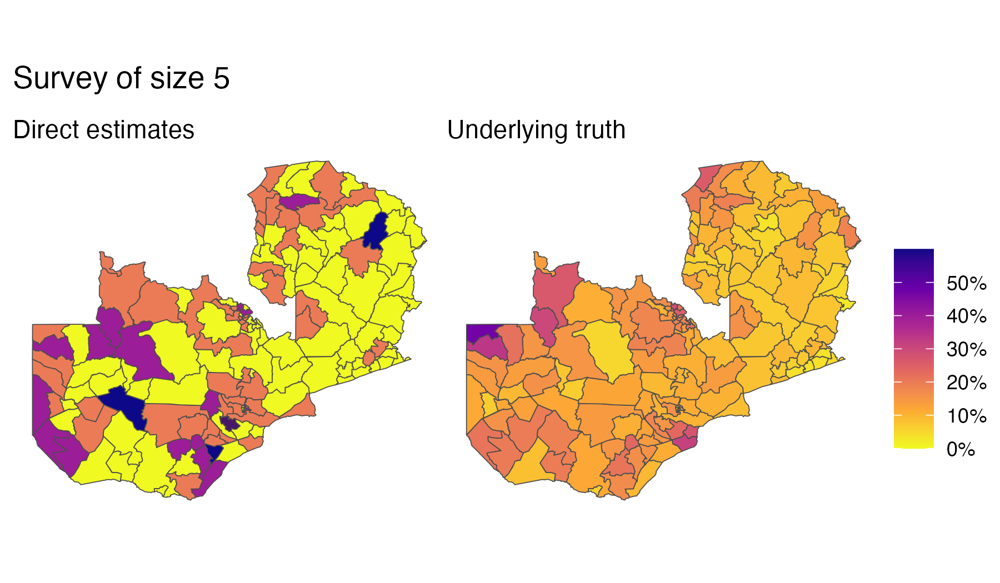
```

#

```{r}
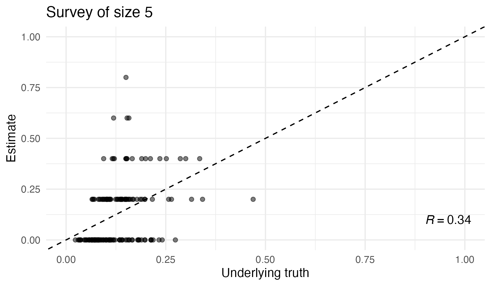
```

#

```{r}
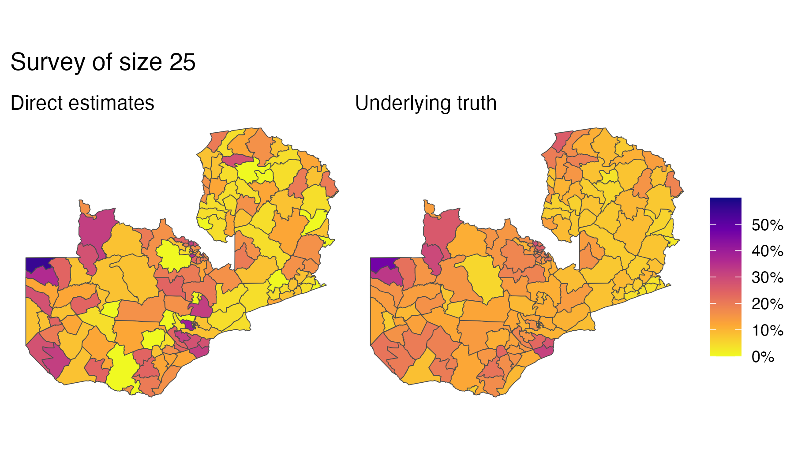
```

#

```{r}
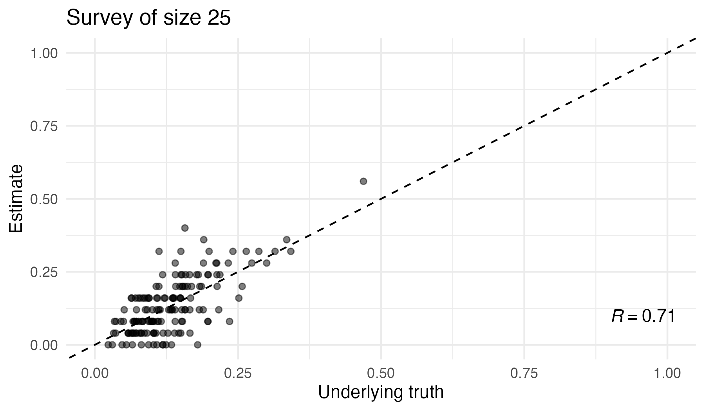
```

#

```{r}
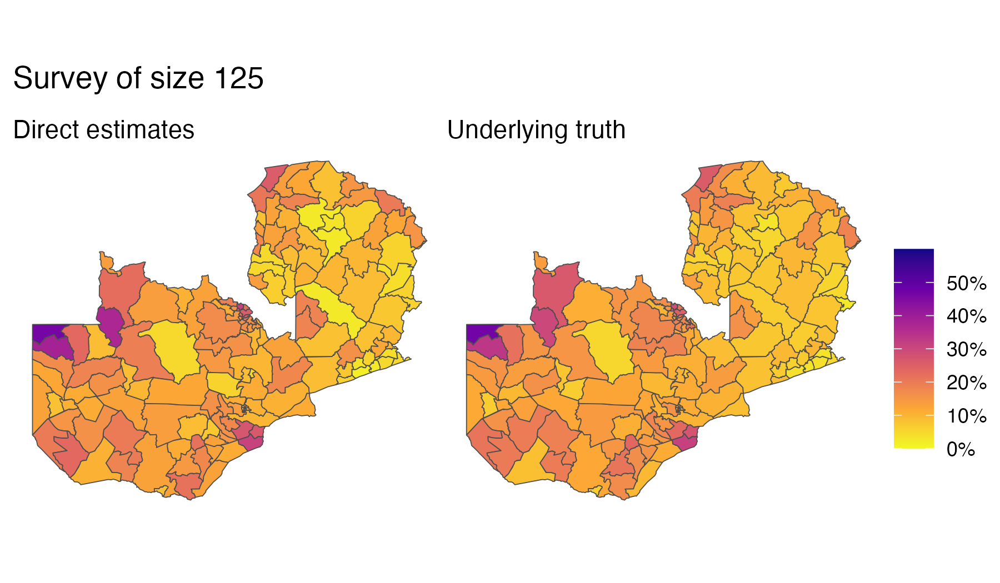
```

#

```{r}
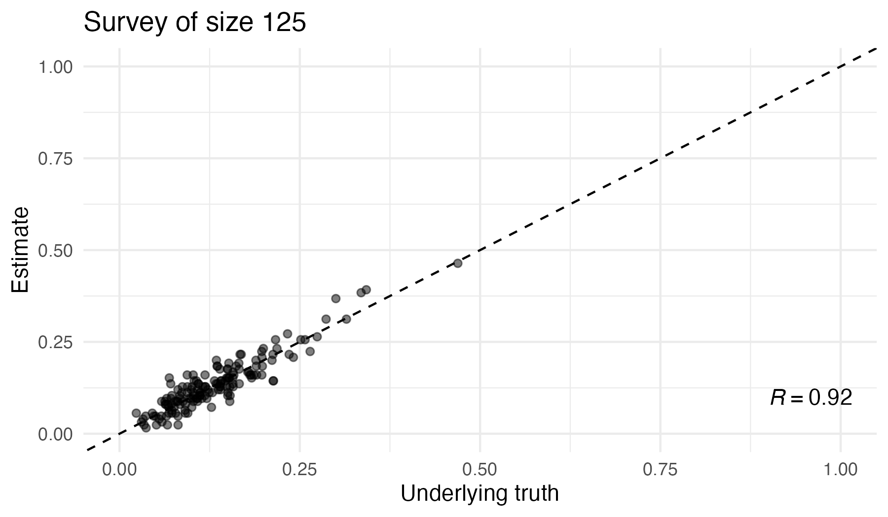
```

#

```{r}

```

#

```{r}
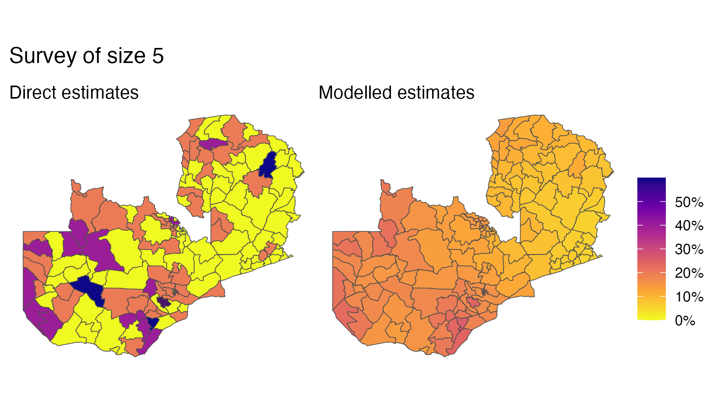
```

#

```{r}
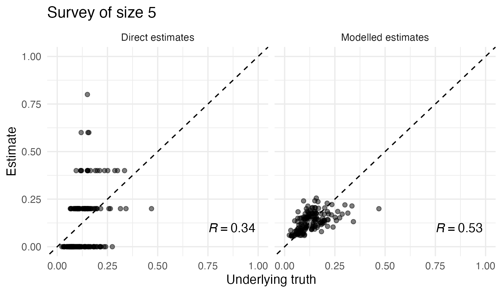
```

#

```{r}
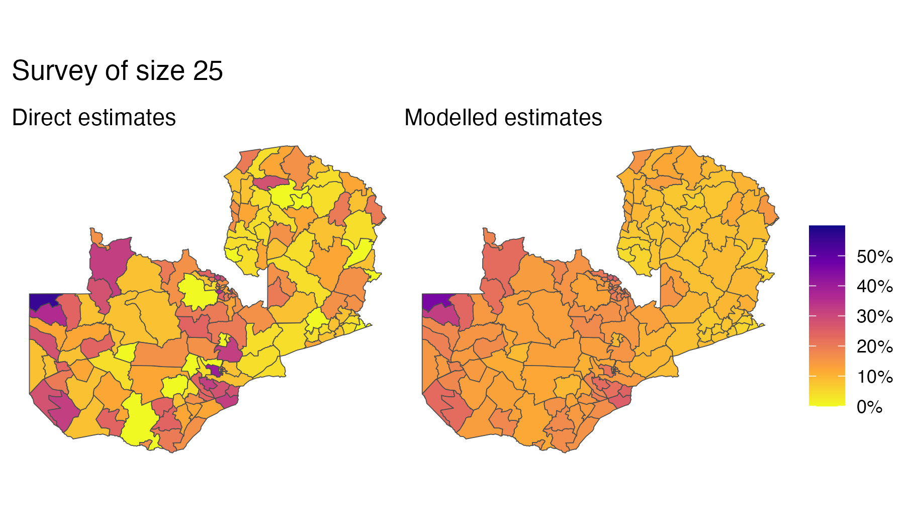
```

#

```{r}
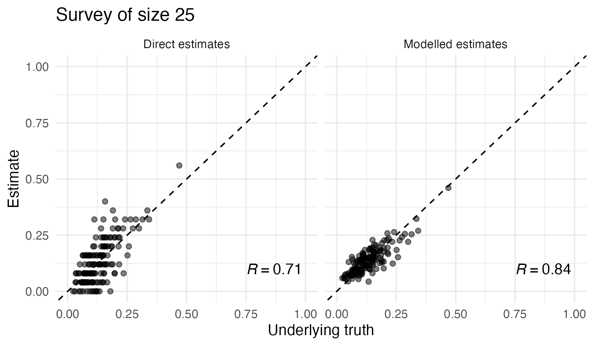
```

#

```{r}
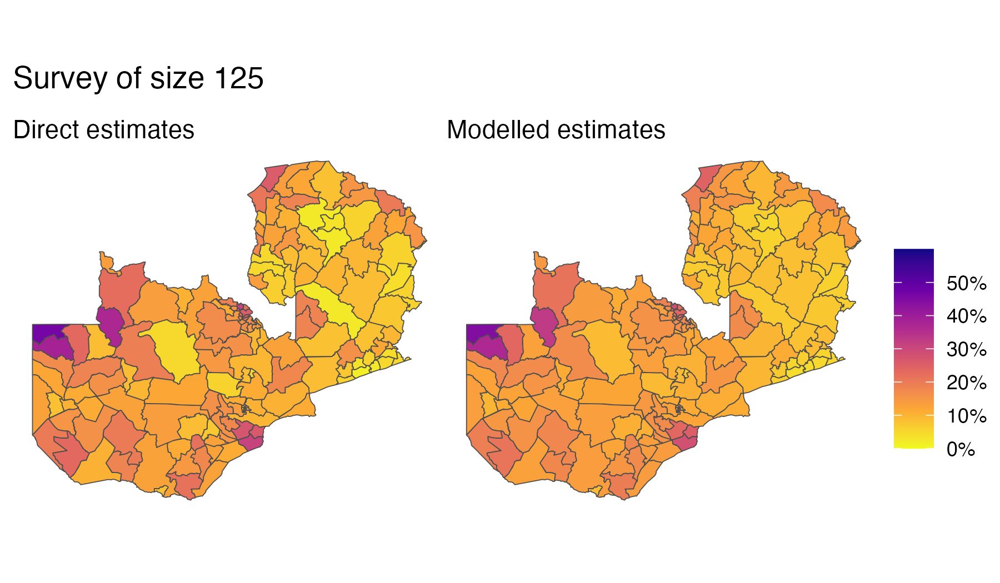
```

#

```{r}
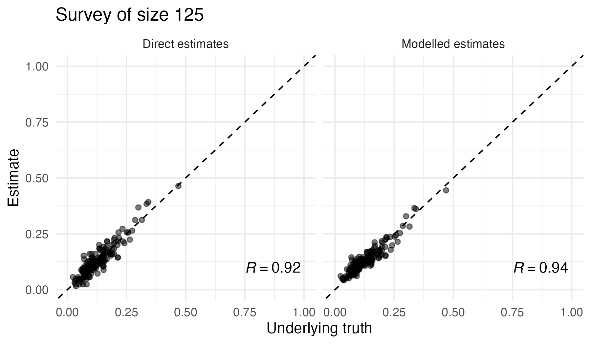
```

#

* @besag1991bayesian
* @simpson2017penalising

# Thanks for listening!

```{r echo=FALSE, out.width = "300px", fig.align='center'}
knitr::include_graphics("figures/mrc-gida-icl-mlgh.png")
```

# References {.allowframebreaks}
